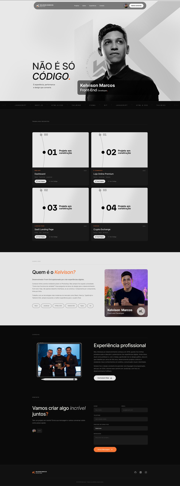
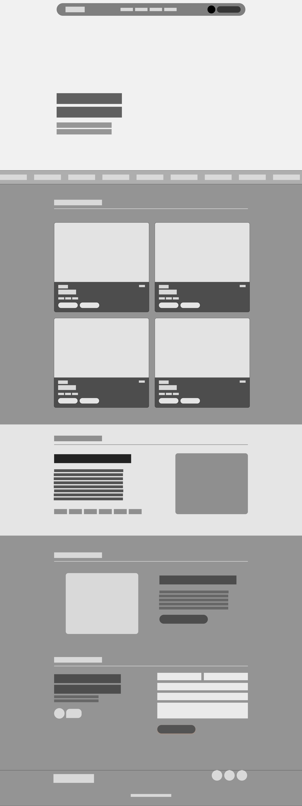
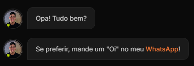
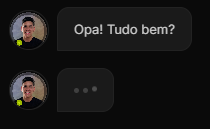

# DevPortfolio

Este é o meu portfólio pessoal, desenvolvido como projeto full stack da minha formação em desenvolvimento web. Ele começou como um site estático e evoluiu para uma aplicação completa: o front-end consome uma API própria para exibir os projetos e receber mensagens de contato, e um painel administrativo protegido por login me permite gerenciar todo o conteúdo sem tocar no código.




## 🌐 Acesse o Projeto

Você pode visualizar o projeto diretamente pelo navegador:

👉 **https://kelvimarcos.github.io/DevPortfolio/**

- API: https://devportfolio-tdf4.onrender.com
- Painel administrativo: acesso restrito por login


## 💡 Insight

Um portfólio que se gerencia sozinho: em vez de editar HTML e fazer novo deploy toda vez que quero trocar um projeto ou revisar um texto, eu entro no meu próprio painel, altero e o site reflete na hora. Além de resolver um problema real meu, o projeto demonstra o ciclo completo de uma aplicação web — interface, API, banco de dados, autenticação e deploy.


## 🎨 Design

- Tema escuro com destaque em laranja, tipografia Inter e hierarquia visual forte
- Hero com animação de entrada e faixa de tecnologias em movimento (marquee)
- Animações de revelação ao rolar a página
- Painel administrativo com identidade visual própria, alinhada à marca do site
- Layout responsivo para desktop, tablet e mobile


## 💻 Front-end

- HTML, CSS e JavaScript puro — sem frameworks
- Cards de projeto renderizados dinamicamente a partir da API (`fetch`)
- Formulário de contato com validação de campos e feedback visual de envio, erro e sucesso
- Cache local dos projetos (`localStorage`) para carregamento instantâneo em visitas repetidas
- Publicado no GitHub Pages


## ⚙️ Back-end

- API REST em Node.js com Express, organizada em rotas, controllers e middlewares
- PostgreSQL com Prisma (ORM, migrations e seed)
- Autenticação de administrador com bcryptjs e sessão em cookie persistida no banco
- Rotas privadas protegidas por middleware de autenticação
- Publicado no Render via Docker, com banco no Supabase


## 🚀 Funcionalidades

- Listagem dinâmica de projetos vinda do banco de dados
- Formulário de contato que grava as mensagens (nome, email, telefone, canal de retorno)
- Login de administrador com sessão segura
- Painel para criar, editar e excluir projetos
- Visualização e exclusão das mensagens recebidas, com vínculo ao projeto de interesse
- Menu mobile animado e navegação suave entre seções


## 🛠️ Tecnologias Utilizadas

HTML5 → Estrutura semântica
CSS3 → Estilização moderna (grid, flexbox, animações, responsividade)
JavaScript → Interatividade e consumo da API
Node.js + Express → API REST
PostgreSQL + Prisma → Banco de dados e ORM
bcryptjs + express-session → Autenticação e sessão
Docker → Container do back-end
GitHub Pages, Render e Supabase → Deploy


## 📖 O que aprendi com este projeto

Construir uma API REST do zero e organizá-la em camadas
Modelar entidades relacionadas e trabalhar com migrations
Implementar autenticação com hash de senha e sessão em cookie
Lidar com CORS e cookies entre domínios diferentes (front e API em hospedagens separadas)
Fazer deploy de front-end estático e de container Docker
Integrar front-end e back-end de forma incremental, sem quebrar o que já funcionava


## ▶️ Rodando localmente

Pré-requisitos: Node.js e PostgreSQL instalados.

```bash
cd server
npm install
cp .env.example .env   # preencher com suas credenciais
npx prisma migrate dev
npm run seed
npm run dev
```

Depois, sirva a raiz do projeto em `http://localhost:5501` (Live Server ou `npx http-server . -a localhost -p 5501`) e ajuste o `js/config.js` para `http://localhost:3333`.

> Importante: usar `localhost` (e não `127.0.0.1`) para o cookie de sessão funcionar entre front e back.

A documentação completa do back-end está em [`server/README.md`](server/README.md).


## ⚠️ Observações Importantes

O deploy da API foi feito no Render em vez do Google Cloud Run por conta de problemas na verificação de faturamento da conta Google — a alternativa é gratuita e roda o mesmo container Docker. No plano gratuito, a API hiberna após um período sem acessos e a primeira visita pode levar alguns segundos (mitigado pelo cache local dos projetos).


## 📌 Próximos Passos

Upload de imagem direto pelo painel (ex: Supabase Storage)
Notificação por email quando uma nova mensagem chegar
Monitoramento da API para evitar a hibernação do plano gratuito
Filtro de projetos por categoria na página inicial


## 🧭 Usabilidade

O projeto nasceu no wireframe abaixo, onde defini a estrutura das seções antes de partir para o design e o código:



### Interação de chat

Um detalhe de usabilidade que gosto de destacar: na seção de contato, simulei uma conversa real de mensageiro. Primeiro aparece o indicador de "digitando..." e, em seguida, a mensagem chega — como se eu estivesse falando com o visitante naquele momento. É um toque pequeno, mas aproxima a experiência de algo humano e convida a pessoa a iniciar a conversa.

| Digitando... | Mensagem recebida |
|---|---|
|  |  |
